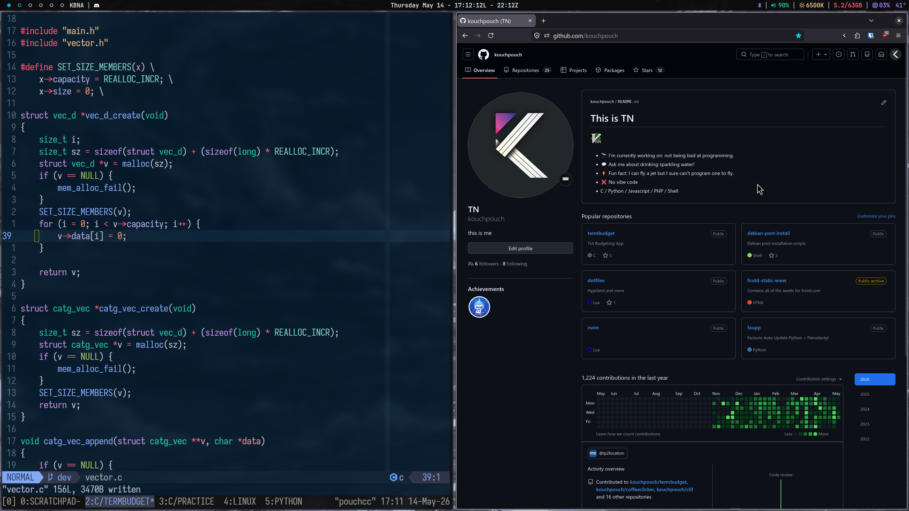

<div align="center">
    <h1 style="padding: 1rem">KouchPouch's Dotfiles</h1>
</div>

For hyprland and other standard programs.

<p align="center">
  
</p>

Use gnu stow to create symlinks into the home directory.

## Hyprland Setup

- Install dependencies

With pacman:
```sh
sudo pacman -S firefox kitty nemo rofi pipewire wireplumber xdg-desktop-portal-hyprland hyprpolkitagent qt5-wayland qt6-wayland waybar hyprpaper nwg-look adw-gtk-theme qt5ct qt6ct pavucontrol ttf-jetbrains-mono-nerd
```

For bluetooth support:
```sh
sudo pacman -S bluez bluez-utils bluetui
```

- v0.55+ Required (Uses Lua configuration files, not hyprlang) check with `hyprctl version`
- Move or stow the contents of hypr/.config/hypr to your Hyprland
    configuration directory, (Usually $HOME/.config/hypr).

```sh
cd dotfiles; stow hypr
```

- Remove the `.example` extension from the example files after modifying them to meet your system's needs.

## Hyprland Quickstart

SUPER = AKA The "Windows" Key

<table style="width:100%">
    <tr>
        <th style="width:40%">Application Binds</th>
        <th>Description</th>
    </tr>
    <tr>
        <td>SUPER + C</td>
        <td>Open terminal</td>
    </tr>
    <tr>
        <td>SUPER + B</td>
        <td>Open browser</td>
    </tr>
    <tr>
        <td>SUPER + E</td>
        <td>Open file explorer</td>
    </tr>
    <tr>
        <td>SUPER + R</td>
        <td>Open launcher</td>
    </tr>
    <tr>
        <td>SUPER + SHIFT + M</td>
        <td>Quit hyprland</td>
    </tr>
</table>

<br>

<table style="width:100%">
    <tr>
        <th style="width:40%">Window Binds</th>
        <th>Description</th>
    </tr>
    <tr>
        <td>SUPER + V</td>
        <td>Open terminal</td>
    </tr>
    <tr>
        <td>SUPER + P</td>
        <td>Open browser</td>
    </tr>
    <tr>
        <td>SUPER + F</td>
        <td>Open launcher</td>
    </tr>
    <tr>
        <td>SUPER + SHIFT + F</td>
        <td>Toggle fullscreen</td>
    </tr>
    <tr>
        <td>SUPER + (H, J, K, L)</td>
        <td>Focus LEFT, DOWN, UP, RIGHT; respectively</td>
    </tr>
    <tr>
        <td>SUPER + SHIFT + (H, J, K, L)</td>
        <td>Move window LEFT, DOWN, UP, RIGHT; respectively</td>
    </tr>
    <tr>
        <td>SUPER + W</td>
        <td>Cycle focus to the next window</td>
    </tr>
</table>

<br>

<table style="width:100%">
    <tr>
        <th style="width:40%">Workspace Binds</th>
        <th>Description</th>
    </tr>
    <tr>
        <td>SUPER + 0-9</td>
        <td>Change workspace</td>
    </tr>
    <tr>
        <td>SUPER + SHIFT + 0-9</td>
        <td>Move current window to workspace</td>
    </tr>
</table>

<br>

<table style="width:100%">
    <tr>
        <th style="width:40%">Hyprshot Binds</th>
        <th>Description</th>
    </tr>
    <tr>
        <td>CTRL + SHIFT + 4</td>
        <td>Take screenshot of a region</td>
    </tr>
    <tr>
        <td>CTRL + SHIFT + 2</td>
        <td>Take screenshot of entire screen</td>
    </tr>
</table>

#### This site or product includes IATA/ICAO List data available from https://github.com/ip2location/ip2location-iata-icao.